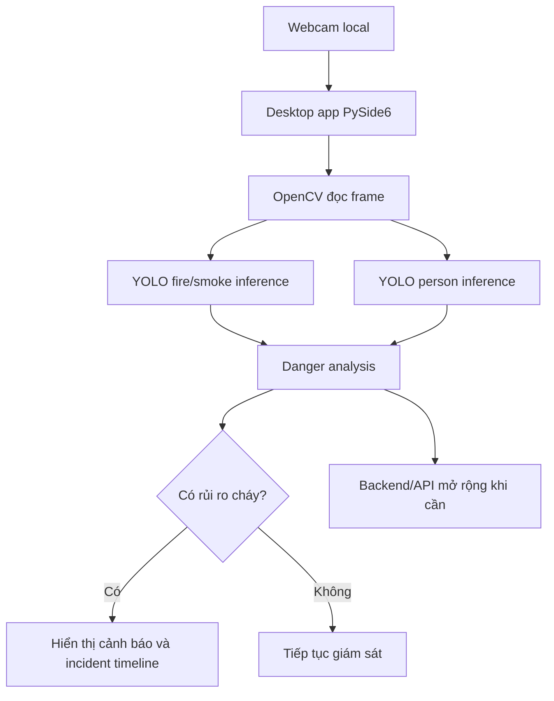

# 🔥 PhoenixVision - Smart Fire Detection

<div align="center">


<br/>

> 🚨 Phát hiện cháy theo thời gian thực bằng AI nhằm hỗ trợ cảnh báo sớm, giảm thiểu thiệt hại và nâng cao an toàn.

</div>

---

# 📌 Giới thiệu dự án

**PhoenixVision** là hệ thống ứng dụng trí tuệ nhân tạo kết hợp mô hình **YOLO** và kỹ thuật **xử lý ảnh thời gian thực** nhằm phát hiện nguy cơ cháy từ camera giám sát.

Hệ thống hiện tập trung vào **giao diện desktop PySide6** trong `desktop-app/`, cho phép mở camera local, nhận diện lửa/khói, nhận diện người gần vùng nguy hiểm và hiển thị cảnh báo trực tiếp cho người vận hành.

Các chức năng chính:

- 🔍 Nhận diện lửa và khói theo thời gian thực
- 🧍 Nhận diện người bằng `yolo11n.pt` để đánh giá rủi ro khi có người gần vùng cháy
- 🎥 Hỗ trợ webcam local, có thể mở rộng sang CCTV, RTSP/IP Camera và video file
- ⚡ Hiển thị bounding boxes, confidence, FPS và trạng thái rủi ro trực tiếp
- 🖥️ Cung cấp desktop app PySide6 làm giao diện chính
- 🧩 Cung cấp AI service FastAPI/OpenCV cho inference và WebSocket stream khi cần
- 🔔 Hỗ trợ backend FastAPI cho lịch sử phát hiện, cảnh báo, emergency và incident timeline
- 🧠 Ứng dụng Deep Learning trong giám sát an toàn
- 📊 Hỗ trợ mở rộng sang quản lý nhiều camera, thống kê và dashboard vận hành

---

# ✨ Tính năng nổi bật

## 🚨 Phát hiện cháy thời gian thực

- Sử dụng model YOLO custom `ai-service/models/fire.pt` để nhận diện `fire` và `smoke` trực tiếp từ camera.

## 🧍 Phân tích người trong vùng nguy hiểm

- Sử dụng `yolo11n.pt` để nhận diện `person`.
- Khi phát hiện `fire/smoke` và có người gần vùng nguy hiểm, hệ thống đánh dấu trạng thái rủi ro để hỗ trợ cảnh báo sớm.

## 📷 Hỗ trợ nhiều nguồn camera

- Webcam local
- Camera giám sát
- CCTV
- RTSP/IP Camera
- Video file

## 🔔 Hệ thống cảnh báo

- Tự động ghi nhận sự kiện khi phát hiện nguy cơ cháy
- Lưu timeline sự cố để phục vụ theo dõi và truy vết
- Có thể mở rộng:
  - Gửi Email
  - Telegram Bot
  - SMS
  - Còi báo động

## 📈 Khả năng mở rộng

- Smoke Detection
- Heatmap khu vực nguy hiểm
- Quản lý nhiều camera
- AI Analytics
- Dashboard hoặc service client khác kết nối qua API/WebSocket

---

# 🛠️ Công nghệ sử dụng

| Công nghệ | Vai trò |
|---|---|
| Ultralytics YOLO | Phát hiện đối tượng |
| OpenCV | Xử lý ảnh/video |
| PySide6 | Giao diện desktop |
| Python | Desktop app, AI service và backend |
| NumPy | Xử lý dữ liệu |
| PyTorch | Deep Learning |
| FastAPI | Máy chủ API |
| Pydantic | Schema request/response |
| JSON Schema | Contract dùng chung |

---

# 🧠 Kiến trúc hệ thống



---

# 📂 Cấu trúc thư mục

```bash
phoenix-vision-fire-detection/
│
├── desktop-app/           # Giao diện desktop chính
│   ├── assets/            # Logo và tài nguyên giao diện
│   ├── phoenixvision_desktop/
│   ├── requirements.txt
│   └── run.py             # Nút chạy chính cho app desktop
│
├── ai-service/            # YOLO + OpenCV + FastAPI AI service
│   ├── app/               # Mã nguồn dịch vụ AI
│   ├── configs/           # Cấu hình training YOLO
│   ├── models/            # Chứa model YOLO
│   │   └── fire.pt        # Model custom đã commit để clone về chạy được ngay
│   ├── tests/
│   └── requirements.txt
│
├── backend/               # Máy chủ API FastAPI
├── docs/                  # Tài liệu hướng dẫn và kiến trúc
├── shared/                # Contract/schema dùng chung
├── scripts/               # Ghi chú lệnh phát triển
├── docker-compose.yml
└── README.md
```

> `frontend/` React cũ đã được bỏ khỏi `main` và được ignore. Nếu máy local vẫn còn thư mục này thì đó là bản legacy riêng, không phải FE chính của repo hiện tại.

---

# ⚙️ Cài đặt dự án

## 1️⃣ Clone repository

```bash
git clone https://github.com/teehihi/phoenix-vision-fire-detection.git
cd phoenix-vision-fire-detection
```

Các bước bên dưới giả định terminal đang đứng tại thư mục gốc `phoenix-vision-fire-detection`. Nếu mở terminal mới, hãy `cd` lại vào thư mục gốc repository trước.

## 2️⃣ Model sử dụng trong dự án

Repository hiện đã commit sẵn model fire/smoke:

```text
ai-service/models/fire.pt
```

Lưu ý về nhận diện người:

- `fire.pt` là model custom của dự án để nhận diện `fire` và `smoke`.
- `yolo11n.pt` là model YOLOv11 nano mặc định dùng để nhận diện `person`.
- Không cần commit `yolo11n.pt` vào GitHub. Khi chạy lần đầu với `--person-model yolo11n.pt`, Ultralytics sẽ tự tải lại model này nếu máy chưa có và đang có internet.

## 3️⃣ Chạy giao diện desktop chính

Trên macOS hoặc Linux:

```bash
cd desktop-app
python run.py
```

Trên Windows PowerShell:

```powershell
cd desktop-app
python run.py
```

`run.py` sẽ tự kiểm tra môi trường, tạo `.venv` riêng cho desktop app nếu cần, cài dependency trong `desktop-app/requirements.txt` và mở PhoenixVision.

Khi app mở:

- Chọn camera index, mặc định là `0`.
- Bấm `Start` để bắt đầu giám sát.
- Nếu camera `0` không mở được, thử camera `1`.

## 4️⃣ Chạy dịch vụ AI realtime webcam riêng

Nếu muốn test OpenCV window mà không mở desktop app:

Trên macOS:

```bash
cd ai-service
python3 -m venv .venv
source .venv/bin/activate
pip install -r requirements.txt
python -m app.realtime_webcam --model models/fire.pt --person-model yolo11n.pt --camera 0
```

Trên Windows PowerShell:

```powershell
cd ai-service
py -3.12 -m venv .venv
.\.venv\Scripts\activate
pip install -r requirements.txt
python -m app.realtime_webcam --model models/fire.pt --person-model yolo11n.pt --camera 0
```

Realtime runner đã có lọc confidence và temporal smoothing để giảm báo nhầm. Có thể siết chặt khi môi trường nhiều đèn vàng/ánh sáng mạnh:

```bash
python -m app.realtime_webcam --model models/fire.pt --person-model yolo11n.pt --camera 0 --fire-conf 0.65 --smoke-conf 0.60 --stable-frames 4
```

## 5️⃣ Chạy máy chủ API

Backend:

```bash
cd backend
python3 -m venv .venv
source .venv/bin/activate
pip install -r requirements.txt
uvicorn app.main:app --reload --port 8000
```

AI service API/WebSocket:

```bash
cd ai-service
source .venv/bin/activate
uvicorn app.main:app --reload --port 8100
```

AI service cung cấp stream frame đã xử lý qua:

```text
ws://localhost:8100/api/stream/webcam
```

## 6️⃣ Chạy bằng Docker Compose

Docker Compose hiện build backend và AI service:

```bash
docker compose up --build
```

Các cổng mặc định:

```text
Backend API: http://localhost:8000
AI service:  http://localhost:8100
```

Lưu ý: Desktop UI nên chạy trực tiếp trên máy host để truy cập camera và hiển thị cửa sổ native ổn định hơn.

Xem hướng dẫn đầy đủ cho macOS và Windows tại [docs/setup-guide.md](docs/setup-guide.md).

---

# 📚 Tài liệu hướng dẫn

- [Hướng dẫn cài đặt và chạy dự án](docs/setup-guide.md)
- [Hướng dẫn chuẩn bị dataset và train YOLO](docs/training-guide.md)
- [Kiến trúc hệ thống](docs/architecture.md)

---

# 🧪 Dataset

Dự án hướng tới bài toán phát hiện lửa và khói. Dataset huấn luyện nên chứa:

- 🔥 Fire Images
- 💨 Smoke Images
- 🌆 Environment/Normal Images

Dataset cần được annotate theo chuẩn YOLO format trước khi train model. Model sau khi train nên được export thành file `.pt` và đặt tại:

```text
ai-service/models/fire.pt
```

Project đã cung cấp script hỗ trợ chuẩn bị dataset và train model:

```bash
cd ai-service
python -m app.training.prepare_dataset --download-indoor
python -m app.training.train_yolo --data ../datasets/fire_smoke/data.yaml
```

Xem chi tiết tại [docs/training-guide.md](docs/training-guide.md).

---

# 📊 Mục tiêu dự án

- Nâng cao khả năng cảnh báo cháy sớm
- Ứng dụng AI vào an toàn thực tế
- Hỗ trợ nghiên cứu Computer Vision
- Xây dựng hệ thống giám sát thông minh
- Chuẩn bị nền tảng mở rộng sang nhiều camera và cảnh báo tự động

---

# 👨‍💻 Thành viên thực hiện

| Thành viên | GitHub |
|---|---|
| Nguyễn Nhật Thiên | [@teehihi](https://github.com/teehihi) |
| Phạm Văn Hậu | [@vanhau123w-collab](https://github.com/vanhau123w-collab) |
| Trương Công Anh | [@coqanklazy](https://github.com/coqanklazy) |

---

# ⭐ Nếu thấy dự án hữu ích

Hãy để lại một ⭐ cho repository nhé!

<div align="center">

### 🔥 PhoenixVision
#### Smart Fire Detection using YOLO & Real-time Computer Vision

</div>
