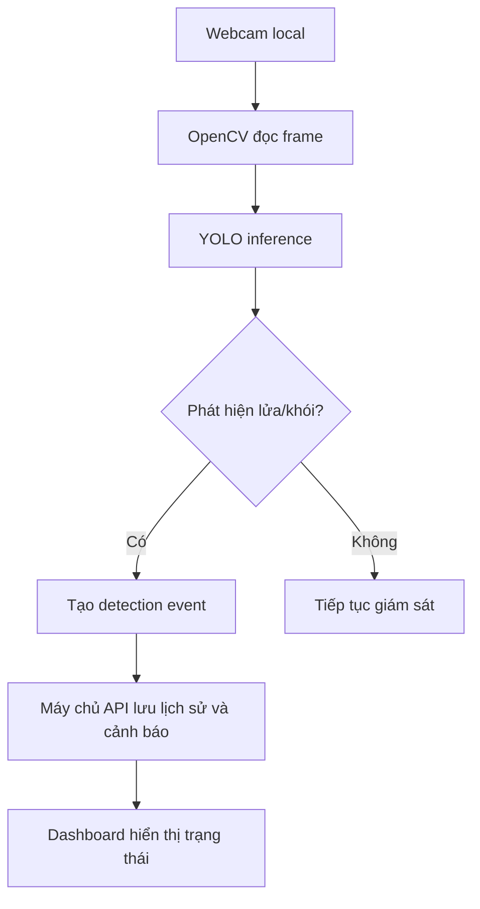

# 🔥 PhoenixVision - Smart Fire Detection


<div align="center">


<br/>

> 🚨 Phát hiện cháy theo thời gian thực bằng AI nhằm hỗ trợ cảnh báo sớm, giảm thiểu thiệt hại và nâng cao an toàn.

</div>

---

# 📌 Giới thiệu dự án

**PhoenixVision** là hệ thống ứng dụng trí tuệ nhân tạo kết hợp mô hình **YOLO** và kỹ thuật **xử lý ảnh thời gian thực** nhằm phát hiện nguy cơ cháy từ camera giám sát.

Hệ thống được định hướng trở thành một nền tảng giám sát an toàn thông minh, có khả năng phân tích hình ảnh từ camera, nhận diện lửa/khói, ghi nhận lịch sử phát hiện và phát cảnh báo kịp thời cho người vận hành.

Các chức năng chính:
- 🔍 Nhận diện lửa và khói theo thời gian thực
- 🎥 Hỗ trợ webcam, camera giám sát, CCTV và RTSP/IP Camera
- ⚡ Hiển thị bounding boxes, confidence và FPS trực tiếp trên luồng video
- 🧩 Cung cấp máy chủ API FastAPI cho lịch sử phát hiện và cảnh báo
- 🖥️ Cung cấp dashboard React + Tailwind để giám sát trực quan
- 🔔 Hỗ trợ hệ thống cảnh báo khi phát hiện nguy cơ cháy
- 🧠 Ứng dụng Deep Learning trong giám sát an toàn
- 📊 Hỗ trợ mở rộng sang phân tích dữ liệu, thống kê và quản lý nhiều camera

---

# ✨ Tính năng nổi bật

## 🚨 Phát hiện cháy thời gian thực
- Sử dụng mô hình YOLO để nhận diện ngọn lửa trực tiếp từ camera.

## 🎯 Độ chính xác cao
- Áp dụng Computer Vision và Deep Learning để giảm cảnh báo giả.

## 📷 Hỗ trợ nhiều nguồn camera
- Webcam
- Camera giám sát
- CCTV
- RTSP/IP Camera
- Video file

## 🔔 Hệ thống cảnh báo
- Tự động tạo cảnh báo khi phát hiện nguy cơ cháy
- Lưu lịch sử cảnh báo để phục vụ theo dõi và truy vết
- Có thể mở rộng:
  - Gửi Email
  - Telegram Bot
  - SMS
  - Còi báo động

## 📈 Khả năng mở rộng
- Smoke Detection
- Heatmap khu vực nguy hiểm
- Dashboard giám sát
- AI Analytics

---

# 🛠️ Công nghệ sử dụng


| Công nghệ | Vai trò |
|---|---|
| Ultralytics YOLO | Phát hiện đối tượng |
| OpenCV | Xử lý ảnh/video |
| Python | Máy chủ API và dịch vụ AI |
| NumPy | Xử lý dữ liệu |
| PyTorch | Deep Learning |
| FastAPI | Máy chủ API |
| React + Tailwind | Giao diện dashboard |


---

# 🧠 Kiến trúc hệ thống



---

# 📂 Cấu trúc thư mục

```bash
phoenix-vision-fire-detection/
│
├── frontend/              # Giao diện React + Tailwind
├── backend/               # Máy chủ API FastAPI
├── ai-service/            # YOLO + OpenCV xử lý webcam realtime
│   ├── app/               # Mã nguồn dịch vụ AI
│   ├── models/            # Chứa model YOLO, ví dụ fire.pt
│   └── requirements.txt   # Thư viện Python cho AI service
├── docs/                  # Tài liệu hướng dẫn và kiến trúc
├── shared/                # Contract/schema dùng chung
├── scripts/               # Ghi chú lệnh phát triển
├── docker-compose.yml
└── README.md
```

---

# ⚙️ Cài đặt dự án

## 1️⃣ Clone repository

```bash
git clone https://github.com/teehihi/phoenix-vision-fire-detection.git
cd phoenix-vision-fire-detection
```

Các bước bên dưới giả định terminal đang đứng tại thư mục gốc `phoenix-vision-fire-detection`. Nếu mở terminal mới, hãy `cd` lại vào thư mục gốc repository trước.

## 2️⃣ Tải model đã train

Repository đã có sẵn thư mục `ai-service/models/`, nhưng không commit trực tiếp file model `.pt`.
Tải model fire/smoke đã train tại đây:

[Tải fire.pt từ Google Drive](https://drive.google.com/file/d/12ZUgw6NmtuVrUQHK-4-Qq5Xams-QI83_/view?usp=sharing)

Sau khi tải xong, đặt file vào đúng đường dẫn:

```text
ai-service/models/fire.pt
```

## 3️⃣ Chạy dịch vụ AI realtime webcam

Trên macOS:

```bash
cd ai-service
python3 -m venv .venv
source .venv/bin/activate
pip install -r requirements.txt
python -m app.realtime_webcam --model models/fire.pt --person-model yolo11n.pt --camera 0
```

Trên Windows PowerShell:

```powershell
cd ai-service
py -3.12 -m venv .venv
.\.venv\Scripts\activate
pip install -r requirements.txt
python -m app.realtime_webcam --model models/fire.pt --person-model yolo11n.pt --camera 0
```

Nếu đã có model phát hiện lửa riêng, đặt file tại:

```text
ai-service/models/fire.pt
```

Sau đó chạy:

```bash
python -m app.realtime_webcam --model models/fire.pt --person-model yolo11n.pt --camera 0
```

Realtime runner đã có lọc confidence và temporal smoothing để giảm báo nhầm. Có thể siết chặt khi môi trường nhiều đèn vàng/ánh sáng mạnh:

```bash
python -m app.realtime_webcam --model models/fire.pt --person-model yolo11n.pt --camera 0 --fire-conf 0.65 --smoke-conf 0.60 --stable-frames 4
```

Hệ thống cũng phân tích nguy hiểm realtime: nếu phát hiện `fire/smoke` và có `person` nằm gần vùng nguy hiểm, dashboard webcam sẽ hiển thị `HUMAN AT RISK` cùng mức rủi ro.

## 4️⃣ Chạy máy chủ API

```bash
cd backend
python3 -m venv .venv
source .venv/bin/activate
pip install -r requirements.txt
uvicorn app.main:app --reload --port 8000
```

## 5️⃣ Chạy AI service dạng WebSocket cho dashboard realtime

```bash
cd ai-service
uvicorn app.main:app --reload --port 8001
```

Dashboard sẽ nhận frame đã xử lý qua:

```text
ws://localhost:8001/api/stream/webcam
```

## 6️⃣ Chạy giao diện dashboard

```bash
cd frontend
npm install
npm run dev
```

Mở trình duyệt tại:

```text
http://localhost:5173
```

Xem hướng dẫn đầy đủ cho macOS và Windows tại [docs/setup-guide.md](docs/setup-guide.md).

---

# 📚 Tài liệu hướng dẫn

- [Hướng dẫn cài đặt và chạy dự án](docs/setup-guide.md)
- [Hướng dẫn chuẩn bị dataset và train YOLO](docs/training-guide.md)
- [Thiết kế phân tích rủi ro cháy realtime](docs/risk-analysis.md)
- [Thiết kế hệ thống phản ứng khẩn cấp](docs/emergency-response.md)
- [Thiết kế incident timeline chuyên nghiệp](docs/incident-timeline.md)
- [Kiến trúc realtime WebSocket streaming](docs/realtime-communication.md)
- [Kiến trúc hệ thống](docs/architecture.md)

---

# 🧪 Dataset

Dự án hướng tới bài toán phát hiện lửa và khói. Dataset huấn luyện nên chứa:
- 🔥 Fire Images
- 💨 Smoke Images
- 🌆 Environment/Normal Images

Dataset cần được annotate theo chuẩn YOLO format trước khi train model. Model sau khi train nên được export thành file `.pt` và đặt tại:

```text
ai-service/models/fire.pt
```

Repository hiện tại không commit dataset và model weights lớn lên GitHub. Model mẫu đã train được lưu ngoài repository tại link Google Drive ở phần cài đặt. Nếu train lại model mới, hãy thay file tại `ai-service/models/fire.pt`.

Project đã cung cấp script hỗ trợ chuẩn bị dataset và train model:

```bash
cd ai-service
python -m app.training.prepare_dataset --download-indoor
python -m app.training.train_yolo --data ../datasets/fire_smoke/data.yaml
```

Xem chi tiết tại [docs/training-guide.md](docs/training-guide.md).

---

# 📊 Mục tiêu dự án

- Nâng cao khả năng cảnh báo cháy sớm
- Ứng dụng AI vào an toàn thực tế
- Hỗ trợ nghiên cứu Computer Vision
- Xây dựng hệ thống giám sát thông minh

---

# 👨‍💻 Thành viên thực hiện

| Thành viên | GitHub |
|---|---|
| Nguyễn Nhật Thiên | [@teehihi](https://github.com/teehihi) |
| Phạm Văn Hậu | [@vanhau123w-collab](https://github.com/vanhau123w-collab) |
| Trương Công Anh | [@coqanklazy](https://github.com/coqanklazy) |


---


# ⭐ Nếu thấy dự án hữu ích

Hãy để lại một ⭐ cho repository nhé!

<div align="center">

### 🔥 PhoenixVision
#### Smart Fire Detection using YOLO & Real-time Computer Vision

</div>
