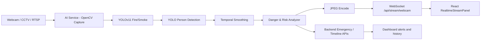

# Kiến Trúc Realtime Communication

Tài liệu này mô tả cách PhoenixVision truyền frame đã xử lý từ AI service sang React dashboard với độ trễ thấp.

## Mục Tiêu

- Stream frame webcam đã qua YOLOv11/OpenCV lên dashboard.
- Cập nhật risk score, trạng thái `HUMAN AT RISK`, FPS và danh sách detection theo thời gian thực.
- Hỗ trợ reconnect khi mất kết nối WebSocket.
- Tách rõ vai trò giữa AI service, backend nghiệp vụ và frontend.

## Luồng Tổng Quan



## Vai Trò Từng Thành Phần

`ai-service`
: Đọc camera bằng OpenCV, chạy YOLOv11, vẽ bounding box, tính risk và stream frame realtime qua WebSocket.

`backend`
: Quản lý detection history, emergency state, incident timeline, acknowledgement và các API nghiệp vụ.

`frontend`
: Hiển thị video đã xử lý, trạng thái kết nối, risk level, object counts, incident timeline và emergency panel.

## WebSocket Endpoint

Endpoint hiện tại:

```text
ws://localhost:8001/api/stream/webcam
```

Query parameters:

| Tham số | Ý nghĩa | Mặc định |
|---|---|---|
| `camera` | Index webcam OpenCV | `0` |
| `width` | Chiều rộng capture | `960` |
| `height` | Chiều cao capture | `540` |
| `fps` | FPS mục tiêu để gửi lên React | `12` |
| `quality` | JPEG quality | `72` |
| `model` | Model fire/smoke | `models/fire.pt` |
| `person_model` | Model nhận diện người | `yolo11n.pt` |
| `person_every` | Số frame mới chạy person detection một lần | `4` |

Ví dụ:

```text
ws://localhost:8001/api/stream/webcam?camera=0&fps=12&quality=72&person_every=4
```

## Payload Gửi Sang React

```json
{
  "type": "processed_frame",
  "cameraId": "webcam-0",
  "timestamp": 1716700000.0,
  "fps": 12.4,
  "frame": "base64-jpeg",
  "detections": [
    {
      "label": "fire",
      "confidence": 0.88,
      "boxes": [{ "x": 120, "y": 90, "width": 180, "height": 220 }]
    }
  ],
  "risk": {
    "riskLevel": "HIGH",
    "riskScore": 72.5,
    "status": "HUMAN AT RISK",
    "humanAtRisk": true,
    "durationSeconds": 8.4,
    "frameConsistency": 0.92,
    "humansNearbyCount": 1,
    "fireDetected": true,
    "smokeDetected": true,
    "humanDetected": true,
    "fireAreaRatio": 0.11,
    "smokeAreaRatio": 0.18
  }
}
```

## FastAPI Implementation

File chính:

```text
ai-service/app/api/stream.py
```

Luồng xử lý:

1. Client React mở WebSocket.
2. AI service mở webcam bằng `WebcamStream`.
3. Mỗi frame chạy `YoloDetector` cho fire/smoke.
4. Person detection chạy cách frame bằng `person_every` để giảm tải.
5. `TemporalDetectionSmoother` lọc nhiễu và giảm false positive.
6. `DangerAnalyzer` tính risk score và human danger.
7. Frame được vẽ bounding box/FPS/risk rồi encode JPEG base64.
8. Server gửi JSON sang frontend.

## React Integration

File chính:

```text
frontend/src/hooks/useRealtimeStream.ts
frontend/src/features/detection/RealtimeStreamPanel.tsx
```

Hook `useRealtimeStream` chịu trách nhiệm:

- Mở WebSocket.
- Parse payload `processed_frame`.
- Lưu frame mới nhất vào state.
- Hiển thị lỗi `stream_error`.
- Tự reconnect bằng backoff khi socket đóng.

Component `RealtimeStreamPanel` chịu trách nhiệm:

- Hiển thị frame base64 dưới dạng `data:image/jpeg;base64,...`.
- Hiển thị trạng thái kết nối.
- Hiển thị FPS, risk score, risk level, duration, consistency.
- Hiển thị số lượng fire/smoke/person.

Nếu muốn đổi WebSocket URL, tạo file `.env` trong `frontend`:

```env
VITE_AI_STREAM_URL=ws://localhost:8001/api/stream/webcam?fps=12&quality=72
```

## Tối Ưu Độ Trễ

Nên dùng:

- JPEG quality khoảng `60-75` cho webcam realtime.
- Resolution `960x540` hoặc `1280x720` tùy máy.
- FPS stream `10-15` là đủ cho cảnh báo cháy.
- Chạy person detection mỗi `3-5` frame vì người không cần update từng frame.
- Dùng model nhẹ `yolo11n` cho realtime webcam.
- Dùng GPU nếu có CUDA, còn Mac/CPU nên giữ FPS và resolution vừa phải.

Không nên:

- Gửi PNG vì dung lượng lớn.
- Gửi frame raw qua JSON.
- Chạy mọi detector ở full FPS nếu máy yếu.
- Đẩy toàn bộ video qua backend nghiệp vụ nếu chỉ cần dashboard realtime.

## Error Recovery

Các lỗi cần xử lý:

- Mất camera: AI service gửi `stream_error`.
- Mất WebSocket: React tự reconnect.
- Model chưa tải: AI service trả lỗi khi khởi tạo detector.
- FPS tụt: giảm `width`, `height`, `fps`, hoặc tăng `person_every`.

Frontend nên hiển thị rõ:

- `CONNECTING`
- `CONNECTED`
- `RECONNECTING`
- `ERROR`

## Mở Rộng Cho Nhiều Camera

Khi mở rộng sang nhiều camera:

```text
ai-service/
  app/
    streams/
      webcam_stream.py
      rtsp_stream.py
    api/
      stream.py
    services/
      camera_manager.py
      stream_session.py
```

Ý tưởng:

- Mỗi camera có `cameraId`.
- Mỗi camera có worker riêng đọc frame.
- WebSocket client subscribe theo `cameraId`.
- Backend lưu event theo `cameraId`.
- Snapshot lưu theo `cameraId/yyyy-mm-dd/event-id.jpg`.

## Cấu Trúc Thư Mục Khuyến Nghị

```text
ai-service/app/
├── api/
│   └── stream.py
├── models/
│   └── yolo_detector.py
├── pipelines/
│   ├── temporal_smoothing.py
│   ├── danger_analysis.py
│   └── frame_pipeline.py
├── streams/
│   └── webcam_stream.py
└── utils/
    └── frame_encoding.py

frontend/src/
├── features/
│   └── detection/
│       ├── LiveDetectionPage.tsx
│       └── RealtimeStreamPanel.tsx
├── hooks/
│   └── useRealtimeStream.ts
└── types/
    └── detection.ts
```

## Lệnh Chạy

Chạy AI service WebSocket:

```bash
cd ai-service
uvicorn app.main:app --reload --port 8001
```

Chạy frontend:

```bash
cd frontend
npm run dev
```

Mở:

```text
http://localhost:5173/live
```
